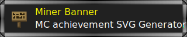

# 

基于 Cloudflare Worker,  
动态生成 SVG 格式 Minecraft 成就横幅图片

[在线生成器](https://miner-banner.firok.workers.dev/)

**可以用来?**  
所有材质资源取自 [mcmod.cn](https://www.mcmod.cn/).  
若模组作者没有特别声明, 一般视为其资源 **不可商用**;  
另外, 图片生成服务基于 Cloudflare Worker,  
只要你确定 **目标访问者的网络可以正常访问 Cloudflare Worker**,  
就直接在各类文档或页面内嵌入图片 URL

**为什么是 SVG 格式?**  
这个项目目的之一就是测试 SVG 技术.  
如果需要生成 PNG 格式图片, 请使用 mcmod.cn 提供的 [成就生成器](https://www.mcmod.cn/tools/achievements/)  

## API

* GET https://miner-banner.firok.workers.dev/svg_achievement
  * `rid` 整型, 图标 ID (mcmod.cn 站内资料 ID)
  * `t` 字符串, 标题
  * `st` 字符串, 副标题
  * `tc` 字符串, 标题颜色, 例: `#c53943`, `c53943`, `#234` `234`
  * `stc` 字符串, 副标题颜色, 例: `#c53943`, `c53943`, `#234` `234`
  * `tf` 字符串, 标题字体列表
  * `stf` 字符串, 副标题字体列表

## 变更记录

* 1.2.0
  * 调整项目结构
  * 细微代码改进
  * 追加初始 banner
  * 调整页面样式
* 1.1.0
  * 现在材质资源会缓存至 Cloudflare Worker KV, 增加图片生成速度
  * 调整页面样式
* 1.0.0
  * 实现基础功能

----

> 
